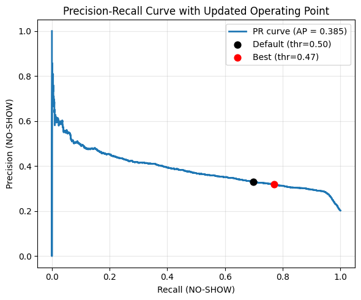
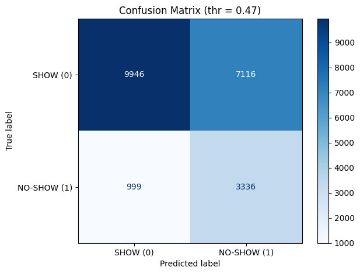
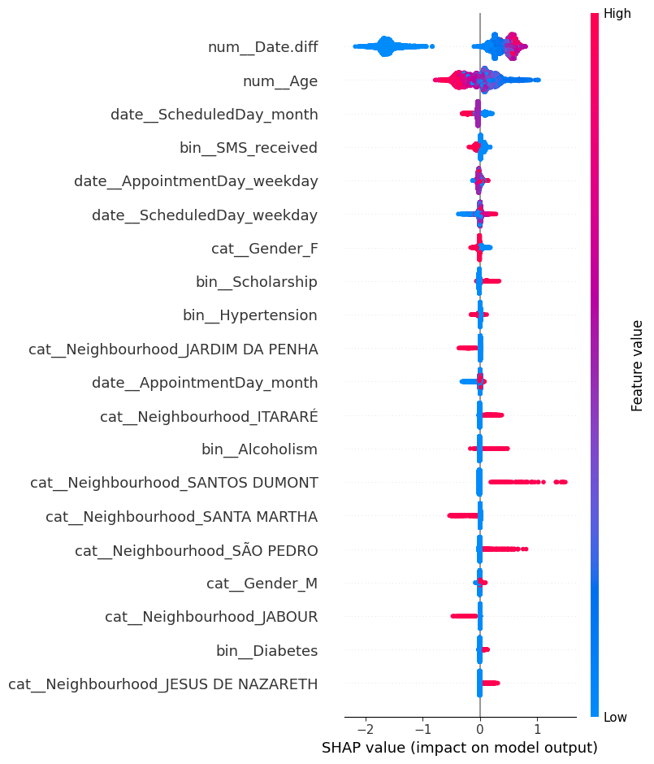

# Medical Appointment No-Show Prediction


BSc Artificial Intelligence — Machine Learning Project

Machine learning project for predicting missed medical appointments using healthcare appointment data.  
The project develops an end-to-end classification pipeline with data cleaning, feature engineering, leakage-free preprocessing, model selection, threshold-based evaluation and SHAP explainability.

## Project Overview

Missed medical appointments, commonly referred to as no-shows, represent a relevant problem for healthcare systems. They can reduce clinical efficiency, increase waiting times and waste appointment slots that could have been assigned to other patients.

The goal of this project is to predict whether a patient is likely to miss a scheduled medical appointment. The analysis focuses on the minority no-show class, since most patients in the dataset attend their appointments.

The project follows a complete machine learning workflow: data cleaning, exploratory data analysis, preprocessing, model selection, refinement, final evaluation and interpretability.

## Dataset

The project uses the Medical Appointment No Shows dataset from Kaggle.

Each row represents a medical appointment and includes patient information, appointment scheduling details, health-related variables and whether the patient attended or missed the appointment.

The original target variable is transformed into a binary target:

- `No_show = 0`: the patient attended the appointment
- `No_show = 1`: the patient missed the appointment

The dataset is imbalanced, with the no-show class representing the minority class. For this reason, the evaluation focuses on metrics that are more informative than accuracy alone.

## Machine Learning Task

This project is formulated as a binary classification task.

The objective is not simply to maximize overall accuracy, but to identify patients at higher risk of missing their appointment. Therefore, the model is evaluated mainly on its ability to detect the positive class:

`No_show = 1`

This makes recall, precision, F1-score, PR curves and threshold tuning particularly important.

## Methodology

The project pipeline includes the following steps:

### Data Cleaning

The dataset is cleaned and prepared before modeling. Date columns are converted into datetime format, inconsistent or unrealistic records are inspected, and the target variable is redefined so that the positive class corresponds to missed appointments.

### Feature Engineering

Additional features are derived from the available appointment information. In particular, temporal variables are used to capture scheduling patterns, waiting time and appointment-related information.

### Preprocessing Pipeline

A structured preprocessing pipeline is used to avoid data leakage and ensure that all transformations are fitted only on the training data.

Different feature types are handled separately:

- numerical variables are imputed and scaled
- binary variables are imputed consistently
- categorical variables are one-hot encoded
- date variables are transformed into engineered temporal features

The preprocessing steps are implemented using `Pipeline` and `ColumnTransformer`.

### Model Selection

Model selection is performed using nested cross-validation. This separates hyperparameter tuning from performance estimation and reduces the risk of selecting a model that performs well only on a specific validation split.

The search space includes different modeling choices, such as:

- classifier type
- resampling strategy
- dimensionality reduction strategy
- classifier hyperparameters

The nested cross-validation procedure consistently selected an XGBoost-based pipeline, without additional resampling and without dimensionality reduction.

### Model Refinement

After model selection, the selected XGBoost pipeline is refined using a focused hyperparameter search. The overall architecture remains fixed, while only a restricted set of XGBoost parameters is tuned.

The refinement is performed only on the training data, keeping the held-out test set untouched for the final evaluation.

## Evaluation

The final model is evaluated on the held-out test set.

Because the dataset is imbalanced, the evaluation does not rely only on accuracy. Instead, it considers several complementary metrics and visualizations:

- F1-score for the no-show class
- precision and recall
- ROC curve and ROC AUC
- precision-recall curve and average precision
- threshold tuning
- confusion matrix at the selected threshold
- false positive rate
- Matthews correlation coefficient
- learning curve

The model outputs predicted probabilities for the no-show class. These probabilities are interpreted as estimated no-show risk scores and are used for threshold-based evaluation.

The selected threshold improves the ability to detect no-shows, but it also increases the number of false positives. For this reason, the model is better suited for soft interventions, such as reminders or follow-up prioritization, rather than automatic high-impact decisions.

## Explainability

SHAP is used to interpret the final XGBoost model.

The SHAP analysis includes:

- a global beeswarm plot
- a global bar plot of mean absolute SHAP values
- a local waterfall plot for an individual prediction

The results show that waiting time is the most influential feature in the final model. Age and appointment-related temporal features also contribute to the predictions, although with smaller effects.

The explainability analysis helps connect the model output to interpretable patient and appointment characteristics.

## Results

The final model captures useful predictive signal for identifying patients at higher risk of missing their appointment. Since the dataset is imbalanced, the evaluation focuses on the minority 'No_show = 1' class rather than overall accuracy.

**Precision-Recall Analysis**  
    
The precision-recall curve shows the trade-off between detecting more no-shows and limiting false positives. The selected operating point improves recall for the no-show class compared with the default threshold.

**Confusion Matrix**
   
The confusion matrix shows the final classification behaviour at the selected threshold. The model identifies a substantial number of no-show patients, but also produces many false positives, confirming that it is more appropriate for reminder prioritization than for automatic deicisons.

**SHAP Explainability**   
  
SHAP analysis shows that waiting time is the most influential feature in the final model, followed by age and appointment-related temporal variables. This helps connect the model predictions to interpretable appointment patterns.

The main findings are:
- the no-show prediction problem is strongly affected by class imbalance
- waiting time is the dominant predictive feature
- XGBoost performs better than the other tested configurations within the explored search space
- threshold tuning is necessary because the default threshold of 0.5 is not necessarily optimal for the minority class
- the model provides useful prioritization signals but should not be interpreted as a perfect decision system

## Limitations and Future Improvements

The main limitation of this project is that no-show behavior is only partially observable from the available variables. Important factors such as previous attendance history, distance from the clinic, work constraints, appointment urgency and detailed socioeconomic information are not included.

Future work could improve the analysis by:

- incorporating richer patient and appointment history
- evaluating cost-sensitive threshold selection
- assessing probability calibration
- validating the model on data from different time periods or healthcare settings
- analyzing fairness across demographic groups

## Tech Stack

### Language

Python

### Libraries

- pandas
- numpy
- matplotlib
- seaborn
- scikit-learn
- imbalanced-learn
- XGBoost
- SHAP

### Techniques

- exploratory data analysis
- feature engineering
- preprocessing pipelines
- nested cross-validation
- randomized hyperparameter search
- imbalanced classification evaluation
- threshold tuning
- SHAP explainability

## Reproducibility

To reproduce the results of this project:

1. Clone the repository.
2. Install the required Python libraries.
3. Open the notebook.
4. Run all cells in order.

```bash
pip install -r requirements.txt
```

## Author
Sabina Gallo  
BSc Artificial Intelligence @ Università di Pavia, Università degli Studi di Milano, Università degli Studi di Milano-Bicocca
